### WPD++: An Improved Neural Beamformer for Simultaneous Speech Separation and Dereverberation

Accepted by SLT 2021

Zhaoheng Ni (zni@gradcenter.cuny.edu), Yong Xu, Meng Yu, Bo Wu, Shixiong Zhang, Dong Yu, Michael I Mandel

 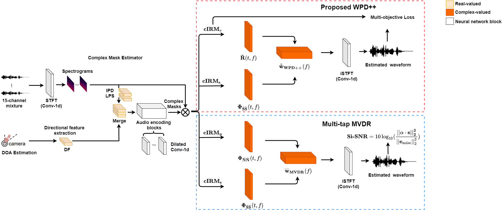 

This paper aims at eliminating the interfering speakers' speech, additive noise, and reverberation from the noisy multi-talker speech mixture that benefits automatic speech recognition (ASR) backend. While the recently proposed Weighted Power minimization Distortionless response (WPD) beamformer can perform separation and dereverberation simultaneously, the noise cancellation component still has the potential to progress. We propose an improved neural WPD beamformer called "WPD++" by an enhanced beamforming module in the conventional WPD and a multi-objective loss function for the joint training. The beamforming module is improved by utilizing the spatio-temporal correlation. A multi-objective loss, including the complex spectra domain scale-invariant signal-to-noise ratio (C-Si-SNR) and the magnitude domain mean square error (Mag-MSE), is properly designed to make multiple constraints on the enhanced speech and the desired power of the dry clean signal. Joint training is conducted to optimize the complex-valued mask estimator and the WPD++ beamformer in an end-to-end way. The results show that the proposed WPD++ outperforms several state-of-the-art beamformers on the enhanced speech quality and word error rate (WER) of ASR.

A Mandarin audio-visual dataset [1,2] is adopted for this study.

Systems evaluated:

- Multi-tap MVDR with cRM: A multi-tap MVDR system with complex ratio mask (cRM) [1]
- WPD with cRM [3,4]
- <strong>The proposed WPD++</strong>

All systems use the sane cRM estimation network that is a Conv-TasNet variant [5] with complex ratio mask

### Demo 1: Simulated 1-speaker noisy mixture for target speech separation [Sorry that all the demos are recorded in Mandarin Chinese.]

Mix (1 speaker + non-stationary additive noise |  Reverberant clean (reference) | Dry clean (reference)
:-------------------------:|:-------------------------:|:-------------------------:
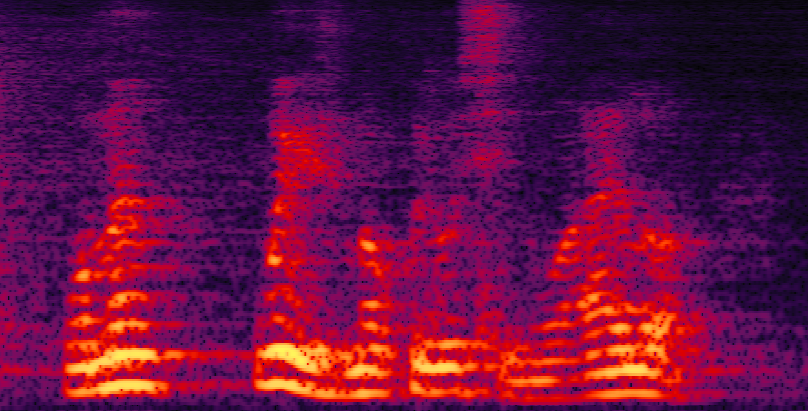  |  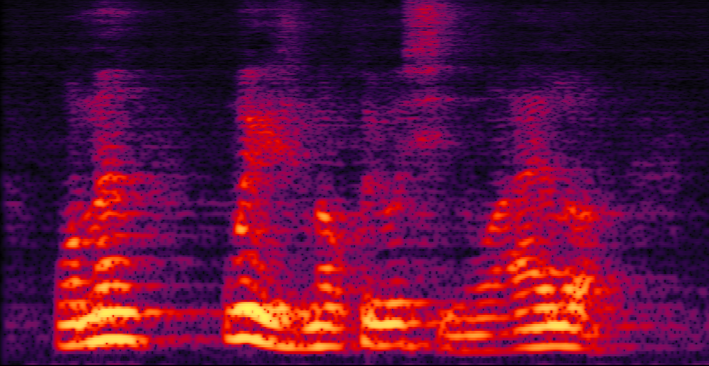 | 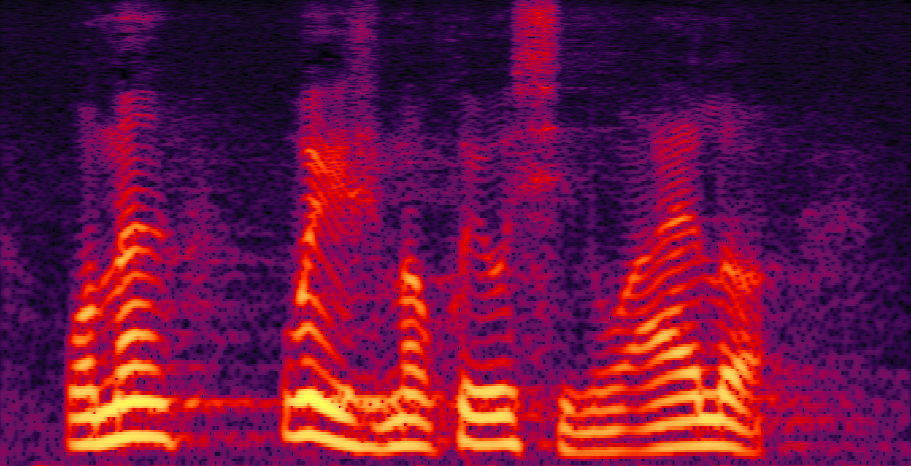
<table width="1068" border="1">
  <tr>
    <td width="255">
        <audio
        controls
        src="1-spk/spk1_mix.wav">
            Your browser does not support the
            <code>audio</code> element.
        </audio>
    </td>
    <td width="255">
    <audio
        controls
        src="1-spk/spk1_reverbclean.wav">
            Your browser does not support the
            <code>audio</code> element.
    </audio>    
    </td>
    <td width="255">
    <audio
        controls
        src="1-spk/spk1_dryclean.wav">
            Your browser does not support the
            <code>audio</code> element.
    </audio>
    </td>
  </tr>
</table>

&nbsp;&nbsp;

Multi-tap MVDR with cRM |  WPD with cRM | <strong>Proposed WPD++</strong>
:-------------------------:|:-------------------------:|:-------------------------:
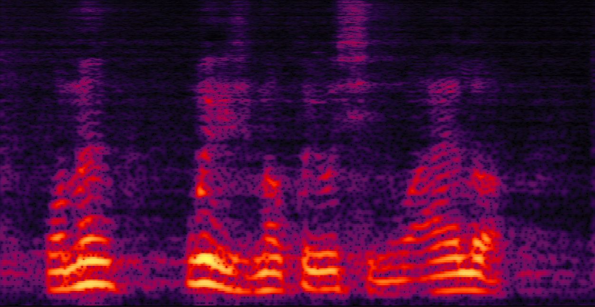  |  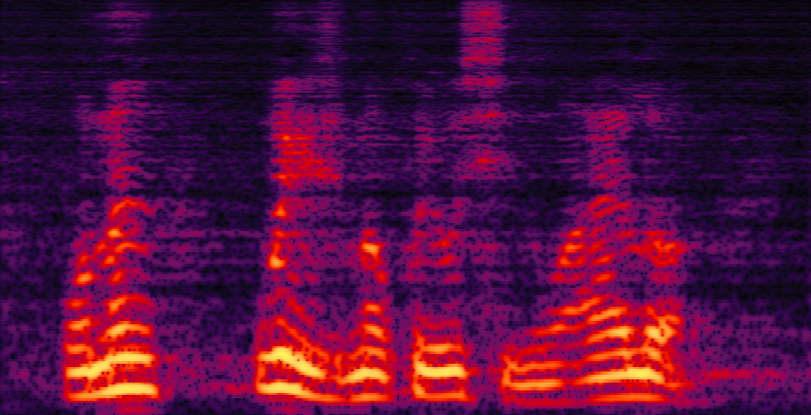 | 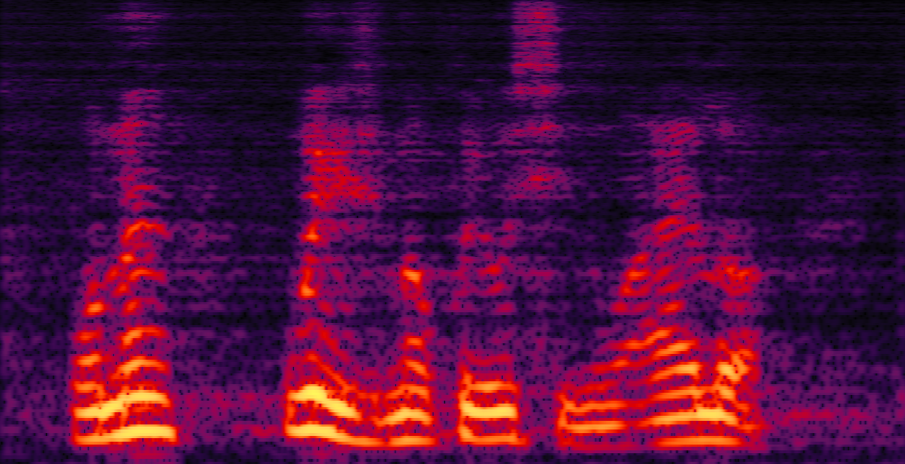
<table width="1068" border="1">
  <tr>
    <td width="255">
        <audio
        controls
        src="/audios/wpd++_demo/spk1_mtmvdr.wav">
            Your browser does not support the
            <code>audio</code> element.
        </audio>
    </td>
    <td width="255">
    <audio
        controls
        src="/audios/wpd++_demo/spk1_wpd.wav">
            Your browser does not support the
            <code>audio</code> element.
    </audio>    
    </td>
    <td width="255">
    <audio
        controls
        src="/audios/wpd++_demo/spk1_wpd++.wav">
            Your browser does not support the
            <code>audio</code> element.
    </audio>
    </td>
  </tr>
</table>

&nbsp;&nbsp;

### Demo 2: Simulated 2-speaker noisy mixture for target speech separation separation

Mix (2 speakers + non-stationary additive noise |  Reverberant clean (reference) | Dry clean (reference)
:-------------------------:|:-------------------------:|:-------------------------:
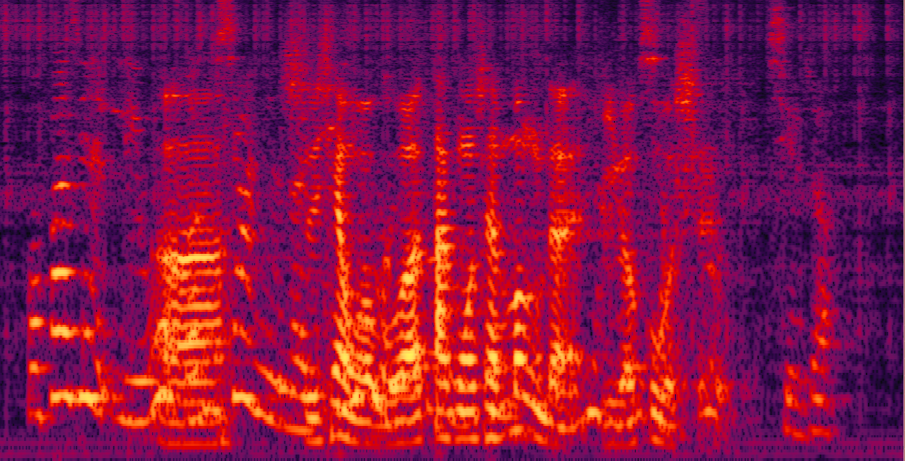  |  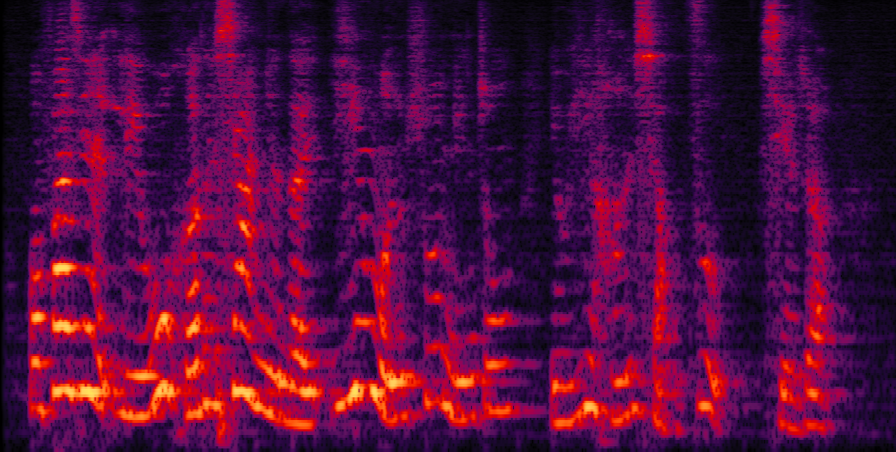 | 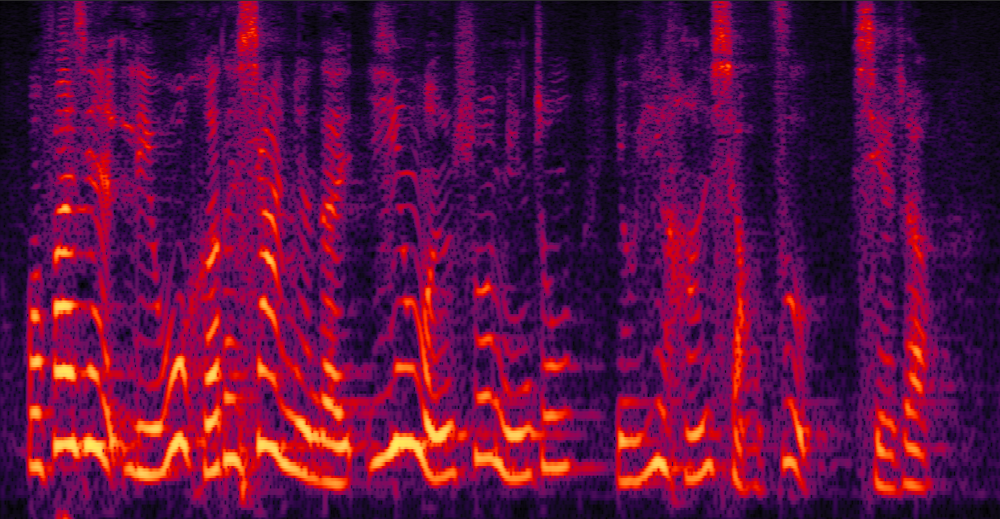
<table width="1068" border="1">
  <tr>
    <td width="255">
        <audio
        controls
        src="2-spk/spk2_mix.wav">
            Your browser does not support the
            <code>audio</code> element.
        </audio>
    </td>
    <td width="255">
    <audio
        controls
        src="2-spk/spk2_reverbclean.wav">
            Your browser does not support the
            <code>audio</code> element.
    </audio>    
    </td>
    <td width="255">
    <audio
        controls
        src="/audios/wpd++_demo/spk2_dryclean.wav">
            Your browser does not support the
            <code>audio</code> element.
    </audio>
    </td>
  </tr>
</table>

&nbsp;&nbsp;

Multi-tap MVDR with cRM |  WPD with cRM | <strong>Proposed WPD++</strong>
:-------------------------:|:-------------------------:|:-------------------------:
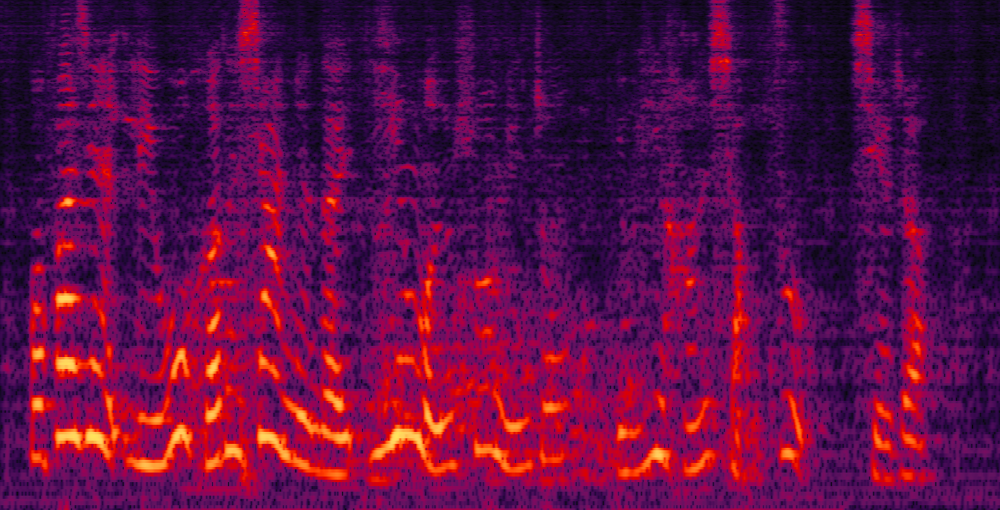  |  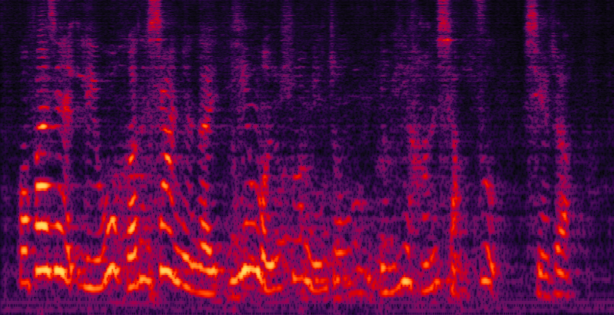 | 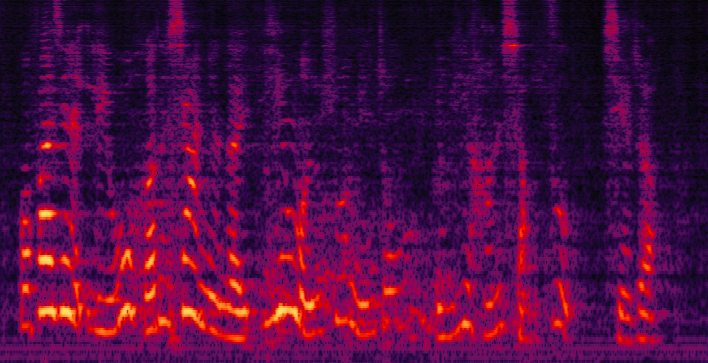
<table width="1068" border="1">
  <tr>
    <td width="255">
        <audio
        controls
        src="2-spk/spk2_mtmvdr.wav">
            Your browser does not support the
            <code>audio</code> element.
        </audio>
    </td>
    <td width="255">
    <audio
        controls
        src="2-spk/spk2_wpd.wav">
            Your browser does not support the
            <code>audio</code> element.
    </audio>    
    </td>
    <td width="255">
    <audio
        controls
        src="2-spk/spk2_wpd++.wav">
            Your browser does not support the
            <code>audio</code> element.
    </audio>
    </td>
  </tr>
</table>

&nbsp;&nbsp;

### Demo 3: Simulated 3-speaker noisy mixture for target speech separation

Mix (3 speakers + non-stationary additive noise |  Reverberant clean (reference) | Dry clean (reference)
:-------------------------:|:-------------------------:|:-------------------------:
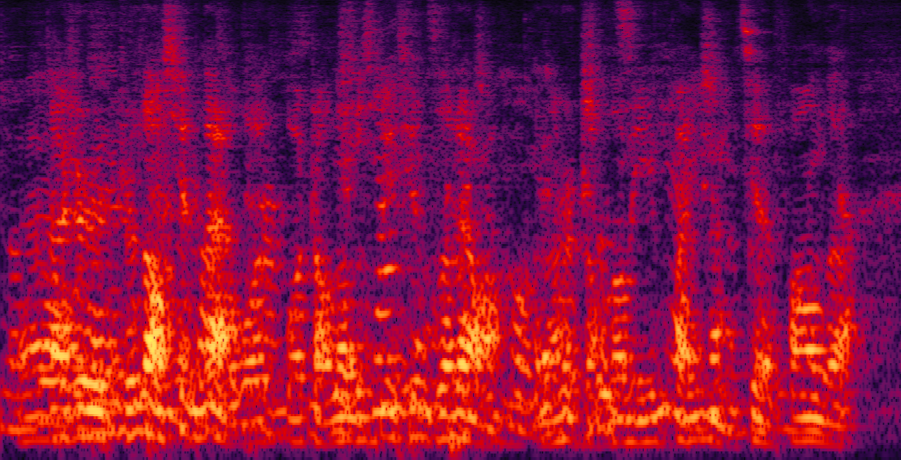  |  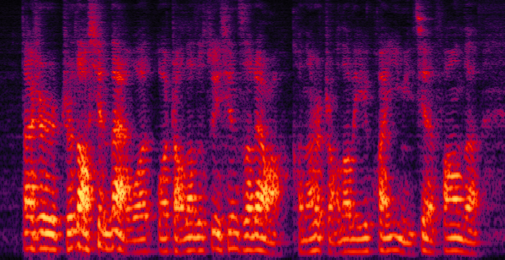 | 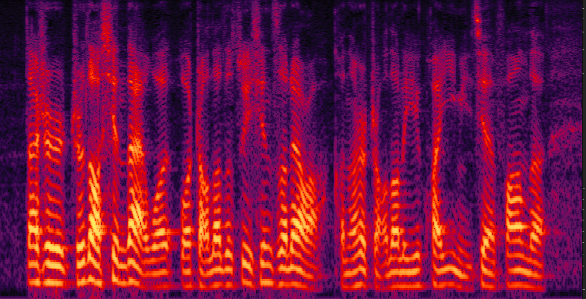
<table width="1068" border="1">
  <tr>
    <td width="255">
        <audio
        controls
        src="3-spk/spk3_mix.wav">
            Your browser does not support the
            <code>audio</code> element.
        </audio>
    </td>
    <td width="255">
    <audio
        controls
        src="3-spk/spk3_reverbclean.wav">
            Your browser does not support the
            <code>audio</code> element.
    </audio>    
    </td>
    <td width="255">
    <audio
        controls
        src="3-spk/spk3_dryclean.wav">
            Your browser does not support the
            <code>audio</code> element.
    </audio>
    </td>
  </tr>
</table>

&nbsp;&nbsp;

Multi-tap MVDR with cRM |  WPD with cRM | <strong>Proposed WPD++</strong>
:-------------------------:|:-------------------------:|:-------------------------:
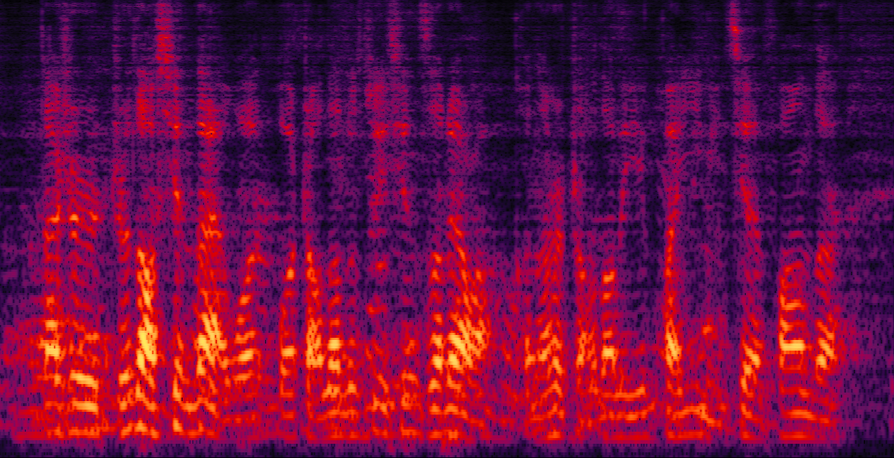  |  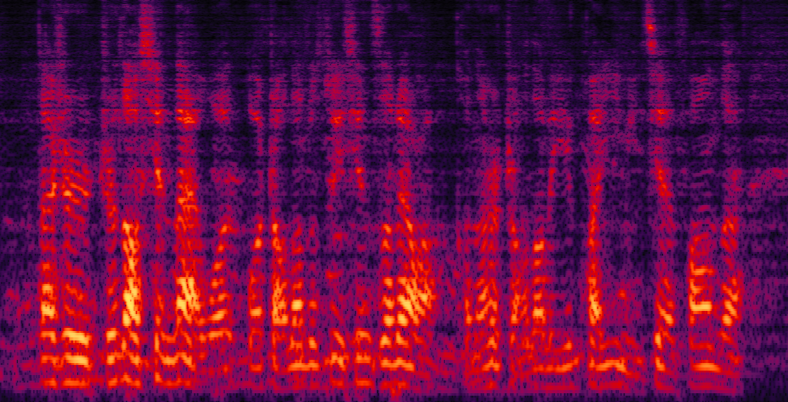 | 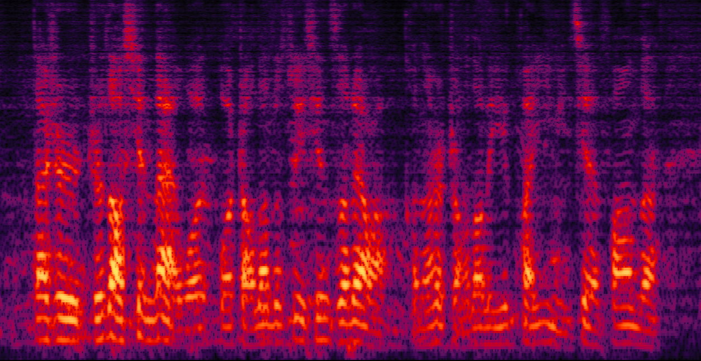
<table width="1068" border="1">
  <tr>
    <td width="255">
        <audio
        controls
        src="3-spk/spk3_mtmvdr.wav">
            Your browser does not support the
            <code>audio</code> element.
        </audio>
    </td>
    <td width="255">
    <audio
        controls
        src="3-spk/spk3_wpd.wav">
            Your browser does not support the
            <code>audio</code> element.
    </audio>    
    </td>
    <td width="255">
    <audio
        controls
        src="3-spk/spk3_wpd++.wav">
            Your browser does not support the
            <code>audio</code> element.
    </audio>
    </td>
  </tr>
</table>

&nbsp;&nbsp;

<strong>Real-world scenario: far-field recording and testing:</strong>

Real-world recording hardware device: 15-element non-uniform linear microphone array and 180 degree wide-angle camera

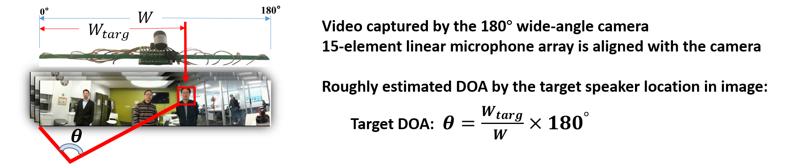

For the real-world videos, the 180-degree wide-angle camera is calibrated and synchronized with the 15-channel mic array. We estimate the rough DOA of the target speaker according to the location of the target speaker in the whole camera view [4]. Face detection is applied to track the target speaker's DOA. 

### Demo 4: Real-world far-field recording and testing 1:
<table width="900">
  <td width="450">
  <video src="real_demos/real_world_demo1_mixture.mp4" width="450" height="300" controls preload></video></td>
  <td width="450">
  <video src="real_demos/real_world_demo1_mtmvdr.mp4" width="450" height="300" controls preload></video></td>
</table>
<table width="900" border="1">
    <td width="450">Real-world scenario: far-field <strong>two-speaker mixture</strong> recorded by the camera and microphone array</td>
    <td width="450">Real-world scenario: <strong>separated male voice</strong> by the multi-tap MVDR method.</td>
</table>

<table width="900">
  <td width="450">
  <video src="real_demos/real_world_demo1_wpd.mp4" width="450" height="300" controls preload></video></td>
  <td width="450">
  <video src="real_demos/real_world_demo1_wpd++.mp4" width="450" height="300" controls preload></video></td>
</table>
<table width="900" border="1">
    <td width="450">Real-world scenario: <strong>separated male voice</strong> by the WPD method.</td>
    <td width="450">Real-world scenario: <strong>separated male voice</strong> by the <strong>proposed WPD++ method</strong> (face detected in the red rectangle, used for DOA estimation).</td>
</table>

### Demo 5: Real-world far-field recording and testing 2:
<table width="900">
  <td width="450">
  <video src="real_demos/real_world_demo2_mixture.mp4" width="450" height="300" controls preload></video></td>
  <td width="450">
  <video src="real_demos/real_world_demo2_mtmvdr.mp4" width="450" height="300" controls preload></video></td>
</table>
<table width="900" border="1">
    <td width="450">Real-world scenario: far-field <strong>two-speaker mixture</strong> recorded by the camera and microphone array</td>
    <td width="450">Real-world scenario: <strong>separated female voice</strong> by the multi-tap MVDR method.</td>
  </table>

<table width="900">
  <td width="450">
  <video src="real_demos/real_world_demo2_wpd.mp4" width="450" height="300" controls preload></video></td>
  <td width="450">
  <video src="real_demos/real_world_demo2_wpd++.mp4" width="450" height="300" controls preload></video></td>
</table>
<table width="900" border="1">
    <td width="450">Real-world scenario: <strong>separated female voice</strong> by the WPD method.</td>
    <td width="450">Real-world scenario: <strong>separated female voice</strong> by the <strong>proposed WPD++ method</strong> (face detected in the red rectangle, used for DOA estimation).</td>
</table>

&nbsp;

<strong>Reference: </strong>

[1] Xu, Yong, et al. "Neural Spatio-Temporal Beamformer for Target Speech Separation." accepted to Interspeech2020.
  

[2] Tan, Ke, et al. "Audio-visual speech separation and dereverberation with a two-stage multimodal network." IEEE Journal of Selected Topics in Signal Processing (2020).

[3] Nakatani Tomohiro, et al. "A unified convolutional beamformer for simultaneous denoising and dereverberation." IEEE Signal Processing Letters, 2019

[4] Zhang, Wangyou, et al. "End-to-End Far-Field Speech Recognition with Unified Dereverberation and Beamforming." arXiv preprint arXiv:2005.10479 (2020).

[5] Luo, Yi, and Nima Mesgarani. "Conv-tasnet: Surpassing ideal time–frequency magnitude masking for speech separation." IEEE/ACM transactions on audio, speech, and language processing 27.8 (2019): 1256-1266.

&nbsp;

